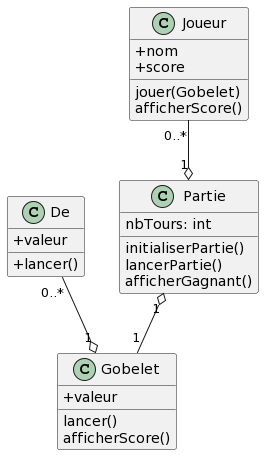

# TP DICE 

## Instructions
A partir du diagramme suivant, créez le projet en question.

On veut pouvoir lancer une partie composé d'un certain nombre de joueurs. 
On aura un tours par joueur + 1
Chaque joueurs lance x dès. Il y aura un dés par joueur dans le gobelet. 
A chaque tour, le joueur ayant le score le plus élevé gagne. 
Le joueur ayant gagné le plus de tours gagné !

Vous êtes tout à fait libre de partir en live sur les éventuels ajouts, ayez du fun !

## Diagramme
